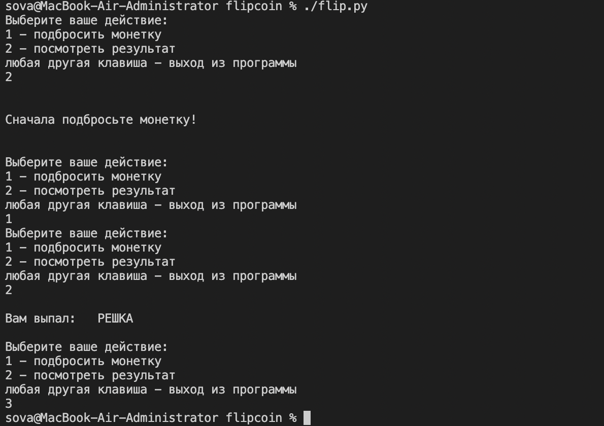
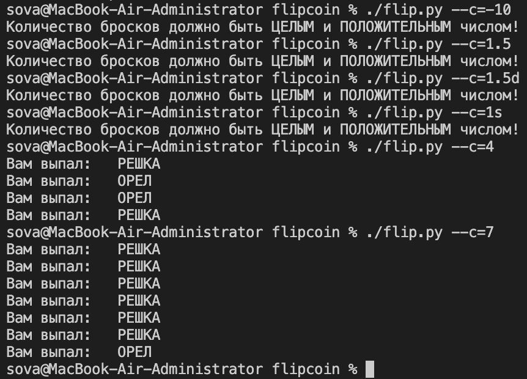

<h1 align="center"> Это проект flipcoin 🪙 </h1>
<h3 align="center"> Скрипт на python которая всегда поможет принять верно даже самое трудное решение! </h3>

<h2 align="left"> Зависимости </h1>
Для корректной работы скрипта необходимо установить python3. Проверить на свой машине можно с помощью команды
<code>python3 --version</code>

Установить python3 на MacOS можно использоваа, например, <a href="https://brew.sh">brew</a>:
<code>brew install python3</code>

На ubuntu:
<code>sudo apt-get upgrade && apt-get install python3</code>

<h2 align="left"> Первый запуск </h1>
Необходимо скачать файл flip.py с репозитория. Запуска с помощью <code>./flip.py</code>. Если выводит ошибку <q>permission denied: ./flip.py</q> то разрешить испольнение файла на MacOS и ubuntu можно командой <code>chmod +x ./flip.py</code>

<h2 align="left"> Описание работы скрипта </h1>
Используйте: <code>./flip.py [--c=N]</code>

Без использования ключа скрипт будет в режиме управления пользователя (появится меню выбора действий)

С использованием ключа указываем количество бросков монетки, где N целое положительное число

